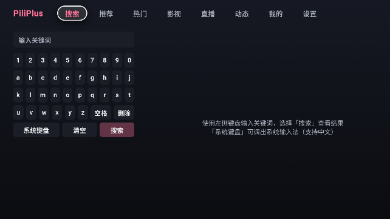

    

    <h1>PiliPlus AndroidTV</h1>
    

        本项目是 [PiliPlus](https://github.com/bggRGjQaUbCoE/PiliPlus) 的非官方衍生版本，
        主要增加 Android TV 与遥控器操作适配。本项目与上游维护者不存在官方隶属关系，
        本项目产生的问题请勿提交至上游仓库。
    

    
使用Flutter开发的BiliBili第三方客户端，在原功能的基础上增加对安卓电视的支持

    

 

 

## 适配平台

- [x] Android
- [x] Android TV
- [x] iOS
- [x] Pad
- [x] Windows
- [x] Linux

## refactor

- [x] 视频界面
- [x] 其他

 

## 声明

此项目是基于 [PiliPlus](https://github.com/bggRGjQaUbCoE/PiliPlus) 增加对安卓电视的功能适配，也是个人为了兴趣而开发，仅用于学习和测试。
本项目的主要维护范围是 Android TV 适配；其他平台功能主要继承自上游，可能因同步上游或兼容性修复而产生差异。，如果你需要的是非tv版本推荐前往 [orz12/PiliPlus](https://github.com/bggRGjQaUbCoE/PiliPlus) 下载。
在此致敬原作者：[guozhigq/pilipala](https://github.com/guozhigq/pilipala)，
在此致敬上游作者：[bggRGjQaUbCoE/PiliPlus](https://github.com/bggRGjQaUbCoE/PiliPlus)，
TV适配核心代码来源于 [PiliPlus-Tizen](https://github.com/jackie099/PiliPlus-Tizen) 的三星电视适配工程，如果你的电视是三星推荐前往该仓库下载。
本仓库仅对安卓电视做了适配以及功能修复修改，感谢这些作者的开源精神。

感谢使用

 

## 项目来源

- 上游项目：[bggRGjQaUbCoE/PiliPlus](https://github.com/bggRGjQaUbCoE/PiliPlus)
- TV 适配参考：[jackie099/PiliPlus-Tizen](https://github.com/jackie099/PiliPlus-Tizen)
- 本衍生版本开始修改时间：2026 年
- 主要修改：Android TV 界面、遥控器焦点导航、TV 播放交互及相关兼容性修复
- 开源许可证：[GNU GPLv3](LICENSE)

## 致谢
- [PiliPlus](https://github.com/bggRGjQaUbCoE/PiliPlus)
- [PiliPlus-Tizen](https://github.com/jackie099/PiliPlus-Tizen)
- [bilibili-API-collect](https://github.com/SocialSisterYi/bilibili-API-collect)
- [flutter_meedu_videoplayer](https://github.com/zezo357/flutter_meedu_videoplayer)
- [media-kit](https://github.com/media-kit/media-kit)
- [dio](https://pub.dev/packages/dio)
- 等等

 
